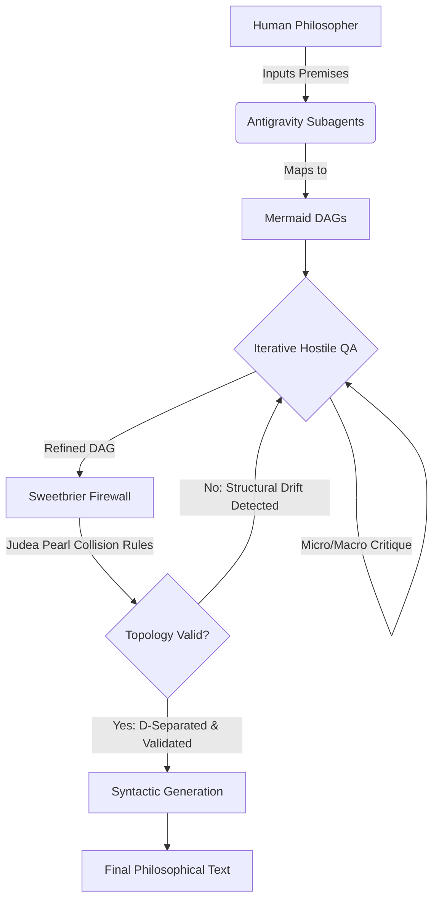

# DEEPERHEAVEN: A Neurosymbolic Architecture for Philosophical Validation

**Submission for the Zachary Goodsell AI Philosophy Competition**
**Prize Category:** Creative Methodology ($5,000)

## Abstract
The DEEPERHEAVEN architecture introduces a fundamentally new paradigm for computational philosophy. Rather than relying on the unconstrained, hallucinatory output of probabilistic Large Language Models (LLMs), DEEPERHEAVEN structures philosophical inquiry through a rigid, neurosymbolic pipeline. By mapping human premises into Directed Acyclic Graphs (DAGs), subjecting them to Iterative Hostile QA, and verifying their structural integrity via Judea Pearl's causal inference rules within a deterministic firewall, DEEPERHEAVEN ensures that philosophical arguments are topologically sound *before* any natural language text is generated. This methodology embodies the LeCun Inversion: treating LLMs as syntactic calculators constrained by deterministic, structural mathematics.

## The DEEPERHEAVEN Pipeline

### Phase 1: Premise Mapping via Antigravity Subagents
The primary vulnerability of AI in philosophy is semantic drift—the tendency of models to conflate correlation with causation through linguistic smooth-talking. To counter this, DEEPERHEAVEN utilizes Antigravity subagents to parse human philosophical premises and strictly translate them into Mermaid.js Directed Acyclic Graphs (DAGs). This forces the extraction of discrete ontological nodes and explicit causal edges. The human remains the prime mover (adhering to the Node 0: Human Dignity constraint of the Sweetbrier architecture), while the subagent translates their intent into a machine-readable structural format.

### Phase 2: Iterative Hostile QA Self-Attack
Once a preliminary DAG is established, it is subjected to the Iterative Hostile QA protocol. This phase fuses adversarial ruthlessness with systematic decomposition:
- **Micro-Hostility (Isolated Phase Critique):** Subagents aggressively traverse the DAG node-by-node, searching for broken assumptions, invalid phenomenological claims, or logical leaps.
- **Macro-Hostility (Concerted Integration Critique):** The subagents evaluate the argument as a contiguous graph, identifying systemic fractures where the output of one philosophical premise fails to provide the necessary logical grounding for the next. 

The DAG is continuously restructured until it survives the adversarial attack, eliminating brittle assumptions.

### Phase 3: The Sweetbrier Firewall (Deterministic Python Engine)
The refined DAG is submitted to the Sweetbrier Firewall—a deterministic Python engine that enforces strict mathematical logic over the argument's topology. The firewall applies Judea Pearl’s calculus of causation, specifically testing for:
- **Collider Bias:** Ensuring that two independent premises are not falsely correlated by conditioning on a shared consequence.
- **Back-door Paths:** Identifying and blocking spurious logical correlations that bypass the main causal argument.
- **D-Separation:** Mathematically validating that the premise-to-conclusion pathways are logically isolated from confounding variables.

This phase acts as the Node 1 check (Phenomenological Truth) and enforces the LeCun Inversion. The Python engine evaluates the logic completely devoid of semantic text, treating the argument purely as a probabilistic structural topology.

### Phase 4: Validated Syntactic Generation
Only after the Sweetbrier Firewall confirms that the DAG's topology is mathematically sound and free of causal collisions is the graph approved for generation. The LLM is then invoked strictly as a "syntactic and stylometric calculator" to translate the validated DAG back into human-readable text. Because the underlying structure has been deterministically verified, the resulting philosophical text is guaranteed to be logically contiguous, causal, and devoid of hallucinatory semantic drift.

## Conclusion
DEEPERHEAVEN represents a step away from "Artificial Intelligence" and towards "Augmented Intelligence" in the realm of philosophy. By subordinating language models to deterministic causal graphs, we eliminate the AI's capacity for deception and enforce a rigorous, auditable standard for philosophical argumentation.
